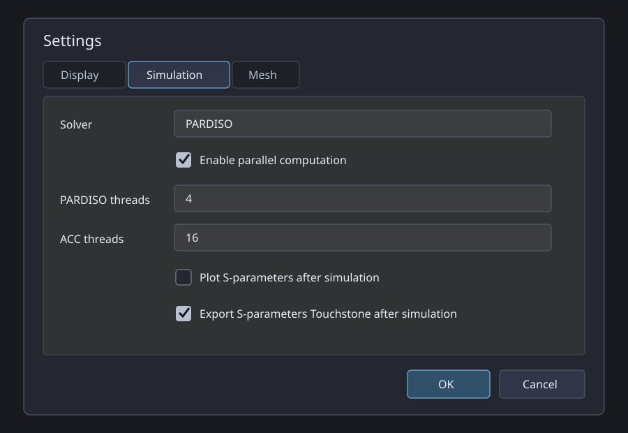
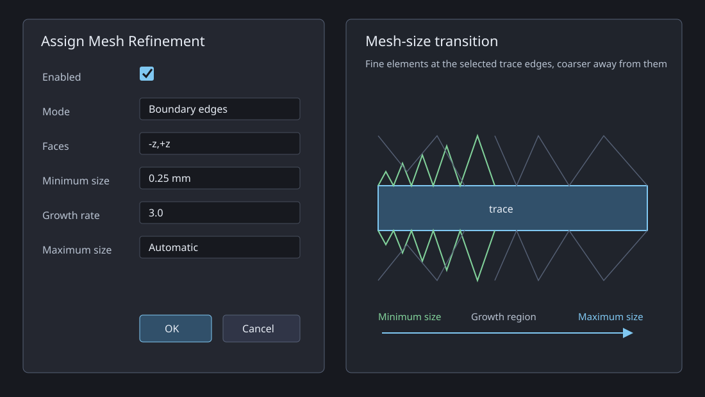

# EM 3D Modeler Help

Version: 1.2.8
Release Date: 2026-09-23

## 1. Overview
EM 3D Modeler is a 3D CAD/EM environment for creating geometries, assigning materials, importing STEP files, performing boolean operations, and generating EMERGE scripts.

## 2. User Interface
- Left Panel: Project Tree and properties of the selected object.
- Center: 3D viewport and information bar.
- Right Panel: Objects/Materials, multi-selection, and quick actions.
- Toolbar: primitives, sketch, boolean operations, STEP import, grid, workspace, units, selection mode.

## 3. Creating Geometries
- Box, Cylinder, Cone, Sphere: click the icon and draw in the viewport.
- Sketch: opens parametric canvas for extrusion or revolution.

Tip:
- Set Plane and Grid first for more precise drawing.

## 4. Selection and Modification
- Single Selection: click on object in viewport or tree.
- Multi-Selection: use Ctrl/Shift in the materials tree.
- Delete Selected: removes the selected object.
- Body Properties: modify geometric parameters, material, color, and opacity.

## 5. Materials
- The Objects/Materials panel groups objects by material.
- Apply materials in bulk to multiple selected objects.
- Supported material databases:
  - Built-in
  - Project DB
  - Global DB
- File Menu:
  - Set Global Material DB
  - Reload Global Material DB

## 6. Boolean Operations
- Cut: subtracts Tool shapes from Base.
- Fuse: merges multiple objects.
- Common: keeps only the intersection.

When the base of a **Cut** is a Plate, the result keeps a persistent Plate simulation role even though its exact cut geometry is stored as a mesh. It remains assignable to a port, survives project reload/undo, and is exported as a Plate-compatible port surface. Existing legacy Cut-Plate results are migrated automatically.

Recommended workflow:
1. Select Base + Tool (or multiple Tools).
2. Confirm the preview window.
3. The result replaces the original objects.

Note on complex STEP geometry:
- For non-manifold or disjoint imported meshes, the system uses robust fallbacks to prevent crashes.

## 7. STEP Import
- File -> Import STEP or STEP Import button in toolbar.
- Supports .step and .stp files.
- Each imported solid is created as a separate MeshObject.

## 8. Reference Planes
- View -> Set Reference Plane to create custom planes.
- The active plane orients the grid and drawing tools.
- From the materials tree, you can rename, activate, or remove planes.

## 9. Saving and Export
- Save Project / Save Project As: saves project in .em3d format.
- Export EMERGE Script: generates an .em script compatible with EMERGE.

## 10. Simulation Settings



- **Solver**: selects the sparse linear solver emitted as `simulationObj.set_solver(...)`. PARDISO is the usual CPU/MKL direct solver. CUDSS uses an NVIDIA GPU and requires a working CUDA/cuDSS installation. SUPERLU, UMFPACK, AASDS and MUMPS require the corresponding backend support in the installed EMerge environment.
- **Enable parallel computation**: enables the configured PARDISO and ACC thread counts. When disabled, the exporter writes one thread for both settings. This option controls shared-memory work inside one simulation; frequency-job parallelism is configured separately by the sweep API.
- **PARDISO threads**: writes `config.set_pardiso_threads(n)`. It controls the MKL-heavy PARDISO solve. More threads can reduce solve time but increase CPU and memory pressure.
- **ACC threads**: writes `config.set_acc_threads(n)`. ACC is the OpenMP-heavy accelerated assembly phase that builds the FEM system before the linear solve. It is not a GPU count.
- **Plot S-parameters after simulation**: after a Sweep or Parametric job, opens `plot_sp` for the complete available S-parameter matrix. Disable it for unattended or batch runs. Output definitions in the Project Tree remain separate plot requests.
- **Export S-parameters Touchstone after simulation**: writes all available S-parameters to a Touchstone `.sNp` file in real/imaginary format with a 50 ohm reference. It applies to Sweep and Parametric results; Eigenmode jobs do not produce this export.

Thread recommendations:

- Start with physical CPU cores rather than the maximum value.
- Avoid assigning all logical cores to both PARDISO and ACC when several simulations run concurrently.
- For CUDSS, ACC threads still affect CPU assembly even though the sparse solve runs on the GPU.

## 11. View and Navigation
- Toolbar **Zoom** group:
  - **Fit All**: fits every visible scene object without changing the current view orientation.
  - **Fit Selection**: fits only the selected visible objects; if nothing is selected, the view is unchanged.
  - **Isometric View**: sets the standard isometric orientation and fits all visible objects.
- View Menu:
  - Reset Camera
  - Top (XY)
  - Front (XZ)
  - Right (YZ)
  - Isometric

## 12. Local Mesh Refinement



Use **Object / Materials -> right-click -> Assign Mesh Refinement...** to refine selected objects. The values in **Settings -> Mesh -> Local Refinement Defaults** initialize this dialog; values confirmed in the assignment are stored in the project and exported to EMERGE.

- **Enabled**: includes or excludes the assignment from the generated script without deleting it.
- **Mode - Boundary edges**: applies `set_boundary_size()` to the perimeter curves of the selected faces. Use this for conductor traces where fields concentrate near edges.
- **Mode - Face**: applies `set_face_size()` to the selected faces. With a Plate, an empty Faces field refines the complete Plate; this is suitable for lumped-port Plates.
- **Faces**: comma-separated axis selectors relative to the exported object: `-x`, `+x`, `-y`, `+y`, `-z`, `+z`. Example: `-z,+z` selects the bottom and top trace faces.
- **Minimum size**: finest requested mesh edge length, in millimetres. It is converted to metres in the EMERGE script.
- **Growth rate**: controls how quickly the mesh becomes coarser away from a refined boundary. A value near `1` produces a longer, smoother transition; a larger value reaches the coarse mesh sooner. Default: `3`.
- **Maximum size**: coarse-size limit outside the refined zone. **Automatic** lets EMERGE use its global mesh size; an explicit value caps the transition. Normally it should be greater than the minimum size.

Recommended CrossTalk setup:

```text
Fuse_T1, Fuse_T2: Boundary edges, Faces -z,+z, 0.25 mm, Growth 3, Maximum Automatic
Port Plates:       Face, Faces empty, 0.10 mm
```

Equivalent EMERGE output:

```python
simulationObj.mesher.set_boundary_size(
    trace.face("-z"), size=0.25e-3, growth_rate=3.0
)
simulationObj.mesher.set_face_size(port_plate, size=0.10e-3)
```

Assignments appear under **Project Tree -> Mesh -> Local Refinements**. Right-click an assignment to **Edit**, **Enable/Disable**, or **Remove** it. Double-click opens Edit directly.

## 13. Check Simulation

Use **Check Simulation** in the top Simulation toolbar group or in the EMERGE Simulation window. The check runs locally without starting EMERGE and reports errors, warnings, and passed checks.

It validates MODEL geometry, materials, enabled frequency jobs, solver configuration, AIR/open boundaries, port assignments, Plate dimensions, LumpedPort direction and resistance, containment inside the AIR region, and physical contact with conductive geometry. A LumpedPort must touch at least two distinct conductive objects representing signal and reference; zero or one contact is a blocking error.

Each click on the top toolbar **Play** button clears the visible simulation log and `StepExport.log`, regenerates the STEP bundle and every enabled simulation script, and saves the master and child scripts automatically in the project `_EmergeSim` directory before opening the Simulation window.

### PML boundaries

Select **PML** in the Open Region wizard to export native EMerge volumetric PML geometry through `em.geo.pmlbox()`. The visual `Air_Region` and `PML_Region` boxes define the inner domain and thickness; their STEP files are replaced in the generated script by the native anisotropic PML volumes.

- **PML thickness**: physical thickness outside the AIR region.
- **Geometrical layers**: number of PML sub-volumes used through the thickness.
- **Mesh layers**: target element layers through the PML; EMerge sets the PML maximum mesh size from thickness divided by this value.
- **Exponent**: polynomial growth of the complex coordinate stretching. Default: `1.5`.
- **Delta max**: maximum matching/attenuation coefficient. Default: `8.0`.

PML is assigned independently on `Xmin`, `Xmax`, `Ymin`, `Ymax`, `Zmin`, and `Zmax`. A face occupied by a WaveguidePort is automatically excluded from global PML, Open, PEC, or PMC assignment so the port excitation is preserved.

For a closed internal waveguide, remove all six global boundaries from the Project Tree (right-click a face -> **Remove Boundary**). The value becomes **None**: EMerge keeps its default exterior PEC walls, while WaveguidePort faces remain the only openings. New projects use None by default.

Set **Boundaries -> Domain** to **None** as well (double-click or right-click -> **Set Domain to None**) when the AIR object is the internal waveguide volume rather than an exterior open region. The AIR geometry remains a MODEL object and is still exported, but it is not treated as an enclosing global-boundary domain and PML is disabled.

## 14. Troubleshooting
- Boolean operation failed:
  - Verify that objects are valid with non-empty geometry.
  - For complex STEP files, use smaller and progressive selections.
- STEP import errors:
  - Check integrity of the CAD file.
  - Try re-exporting the STEP from the original CAD application.
- Material not visible in project:
  - Reload the Global DB and check for duplicate names.

## 15. Quick Commands
- New Project: Ctrl+N
- Open Project: Ctrl+O
- Save Project: Ctrl+S
- Quit: system shortcut (e.g., Alt+F4 on Windows)

## 16. About
In the Help -> About menu, you will find:
- Program name
- Version
- Release date
- Current date
