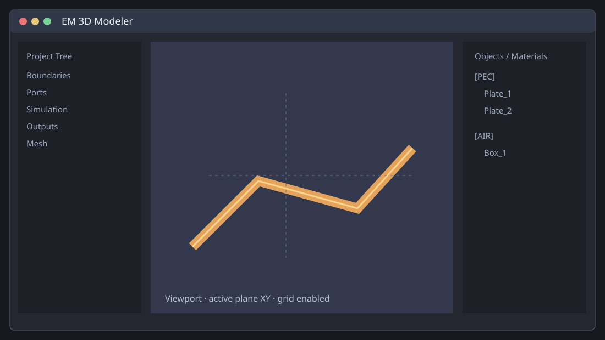
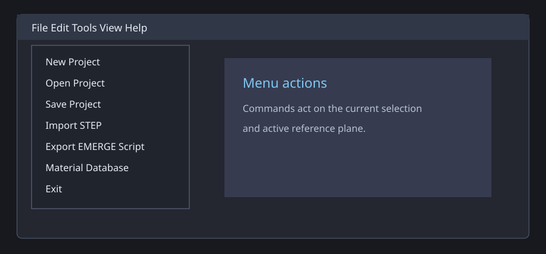
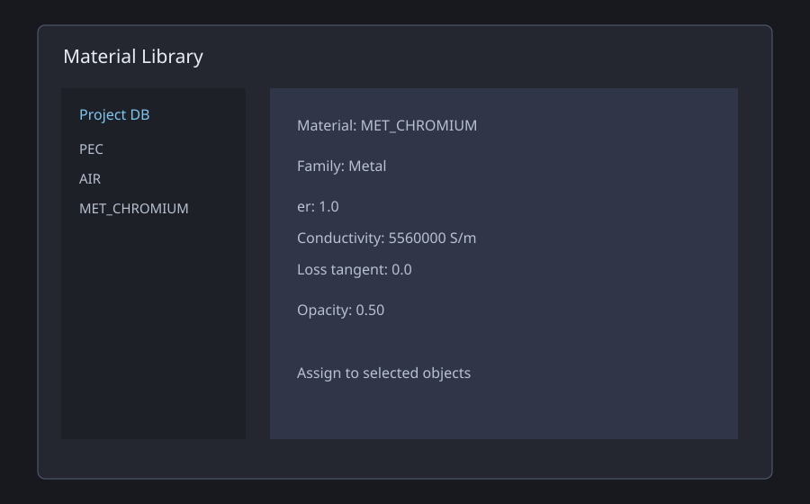
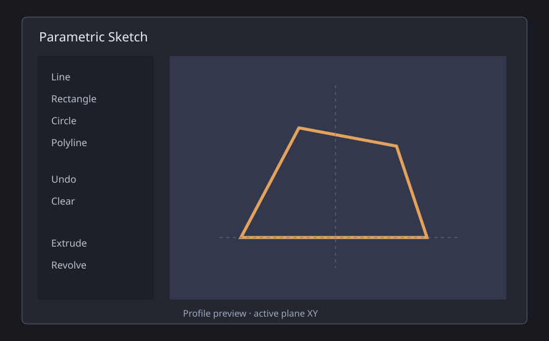
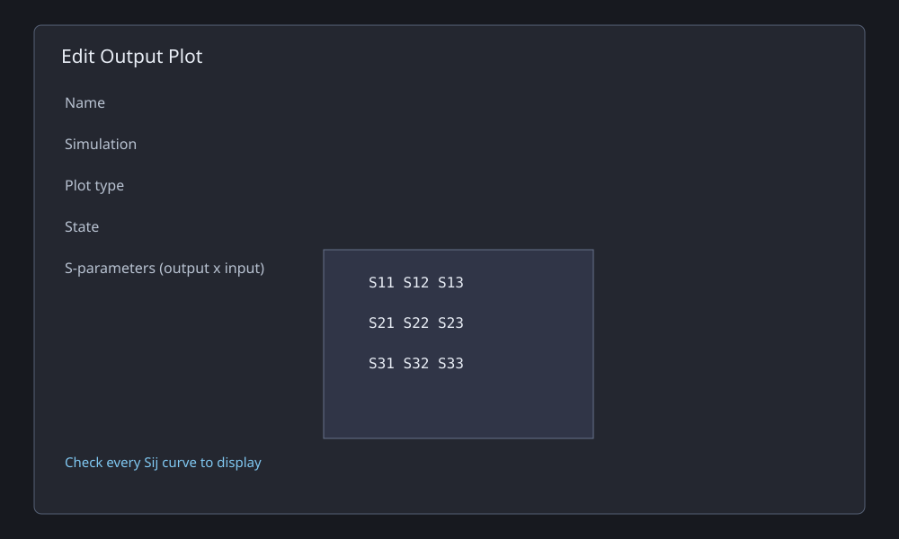
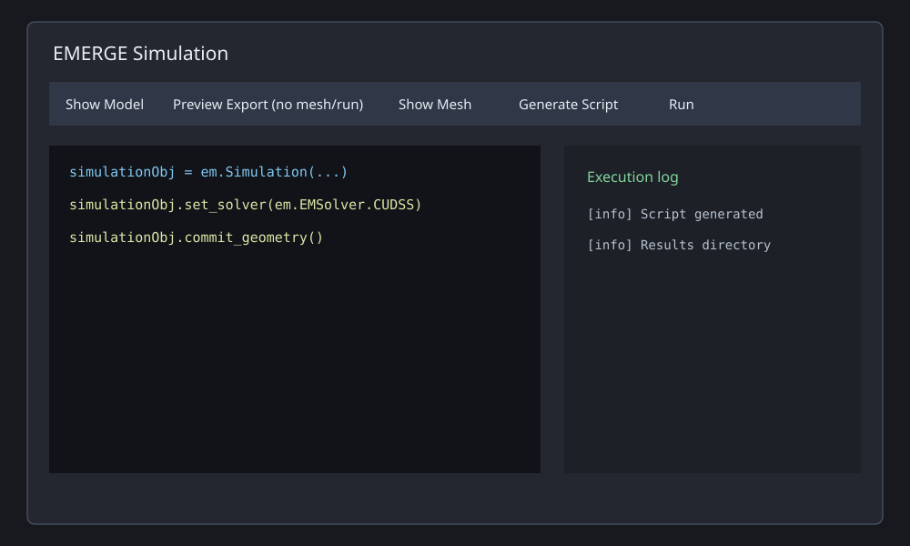

# EM 3D Modeler Help

Version: 1.2.1 Beta 1  
Release date: 2026-09-18

This is the complete operating reference for EM 3D Modeler. The interface illustrations are recreated SVG windows stored in `docs/snapshots`; they are documentation drawings, not captured project data.

## 1. Interface Map



The main window contains:

- **Menu bar:** project files, editing, camera/view, tools and help.
- **Top toolbar:** geometry creation, booleans, scale, transform, pattern, STEP import, simulation and selection mode.
- **Project Tree:** EMERGE boundaries, ports, simulations, outputs and mesh settings.
- **3D Viewport:** drawing, snapping, camera navigation and object selection.
- **Objects / Materials tree:** material groups, object visibility, reference planes and context operations.
- **Properties panel:** parameters for the selected body.
- **Info bar:** coordinates, progress, warnings and result messages.

### Selection conventions

- Click selects one object.
- `Ctrl+click` adds or removes an object from the selection.
- `Shift+click` selects a range in the Objects / Materials tree.
- `Delete` deletes all selected objects.
- The selection is shared between the tree and viewport.
- Sub-selection modes can select a whole body, surface, edge or vertex.

## 2. Menu Reference



### File menu

- **New Project (`Ctrl+N`):** clears the current scene and starts an empty project. Save first if the current project must be preserved.
- **Open Project (`Ctrl+O`):** loads an `.em3d` project, including geometry, transforms, materials, planes, visibility, ports, simulations, outputs and mesh settings.
- **Save Project (`Ctrl+S`):** writes the current project to its existing path. If no path exists, the Save dialog is opened.
- **Save Project As:** writes the project to a new path and makes that path current.
- **Import STEP:** imports `.step` or `.stp` geometry. Imported bodies become scene objects and are exported as STEP entries for EMERGE.
- **Recent Projects:** opens one of the five most recent existing project files. A missing file is removed from the list.
- **Export EMERGE Script:** generates the current EMERGE Python bundle without running it. The bundle contains a master script and one child per enabled simulation.
- **Set Global Material DB:** selects the shared material database file and creates it when required.
- **Reload Global Material DB:** reloads the selected database after external changes.
- **Exit (`Alt+F4`):** closes the application. The application asks whether to save the current project.

### Edit menu

- **Delete Selected (`Delete`):** removes every selected body from the scene, refreshes references and redraws the viewport.
- **Cancel Drawing (`Esc`):** cancels the current drawing or picking operation without creating an object.
- **Undo (`Ctrl+Z`):** restores the previous scene snapshot. The history stores the last ten operations.
- **Redo (`Ctrl+Y`):** reapplies an undone scene snapshot.

### View menu

- **Reset Camera (`Home`):** restores the default 3D camera.
- **Top (XY) (`Ctrl+1`):** looks down the Z axis.
- **Bottom (-XY) (`Ctrl+Shift+1`):** looks up the Z axis.
- **Front (XZ) (`Ctrl+2`):** looks along the negative Y direction.
- **Back (-XZ) (`Ctrl+Shift+2`):** looks along the positive Y direction.
- **Right (YZ) (`Ctrl+3`):** looks along the negative X direction.
- **Left (-YZ) (`Ctrl+Shift+3`):** looks along the positive X direction.
- **Isometric (`Ctrl+4`):** restores a three-quarter 3D view.
- **Set Reference Plane:** opens the non-modal reference-plane editor.
- **Reset Reference Plane:** restores the default XY plane at the origin.
- **Hide/Show Grid:** toggles the viewport grid. Grid size and workspace size are controlled in Settings.

### Tools menu

- **Settings:** opens Display, Simulation and Mesh preferences.
- **Material Library:** opens project/global material databases and the material editor.

### Help menu

- **Help:** opens this HTML guide; Markdown is used as fallback.
- **About:** shows application name, author, version, release date and current date.

## 3. Toolbar Reference

The toolbar is ordered from left to right as follows.

### Creation commands

- **Box:** starts a box drawing operation. Pick the base corners on the active plane, then define depth.
- **Plate:** starts a planar plate operation. The plate is a surface and can be used as a conductor or port surface.
- **Cylinder:** picks a circular base and height.
- **Cone:** picks a base and height; the cone tapers toward its tip.
- **Sphere:** picks the center and radius.
- **Sketch:** opens the parametric sketch window for a profile that can be extruded or revolved.
- **Planar:** creates a planar object from snapped start/end points. Valid snaps include vertices, edges and faces.

### Geometry operations

- **Cut:** Boolean subtraction. The base remains and the selected tool volume is removed from it. Select base/tool in the expected order.
- **Fuse:** Boolean union. Combines selected solids. The counter beside Fuse shows the current selection count.
- **Common:** Boolean intersection. Keeps only the volume shared by the selected solids.
- **Scale:** opens a scale-factor input and applies it to every selected object.
- **Move/Rotate:** opens the transform window. It supports one or many selected bodies and uses a common pivot for group operations.
- **Pattern:** opens linear/circular replication. One source object is required; every generated instance is independent.
- **Dissolve Boolean:** restores source objects from selected boolean result objects.

### Import and simulation

- **Import STEP:** opens a file picker and imports CAD geometry.
- **Play:** opens the EMERGE Simulation window for generation, preview, execution and logs.

### Selection mode

The **Select** combo has four values:

- **All:** pick whole bodies.
- **Surface:** pick one face.
- **Edge:** pick one edge.
- **Vertex:** pick one vertex.

Surface/edge/vertex picking is useful for reference planes and precise snapping; body operations such as Cut and Fuse normally require whole-object selection.

## 4. Object Properties Window


The Properties panel is active when one object is selected.

- **Name:** scene identifier. Renaming updates port, boundary and mesh references.
- **Material:** material assigned to the object. It controls electromagnetic properties and display grouping.
- **Simulation role:** `MODEL` includes the object in export; `NON MODEL` keeps it in the scene but excludes it from simulation geometry.
- **Opacity:** visual opacity from `0.05` to `1.00`. It is also reflected in the EMERGE viewer.
- **Color:** viewport display color. It does not alter material physics.
- **Dimension fields:** primitive dimensions in the current unit system.
- **Transform:** actor origin, position and orientation. These values are persisted and used by export.

## 5. Material Assign and Material Library Windows



### Material assignment

- **Category:** filters the material list by family, such as metals or dielectrics.
- **Source:** chooses Project DB or Global DB.
- **Search:** filters material names and properties.
- **Material list:** selects the record to assign.
- **Family:** classification shown for the selected record.
- **er:** relative permittivity.
- **tan d:** dielectric loss tangent.
- **sigma [S/m]:** electrical conductivity.
- **Color preview/value:** display-only color.
- **Append to project:** copies a global record to the project database before assignment.
- **OK/Cancel:** applies or discards the assignment.

### Material Library

- **Source selector:** switches Project Library and Global Library.
- **Global database path:** file used by the shared library.
- **Search:** narrows the records shown.
- **New:** creates a record in the active library.
- **Edit:** changes the selected record.
- **Delete:** removes the selected record from the active library.
- **Append:** copies a global record into the project library.
- **Reload:** rereads the global database from disk.

### Material Editor

- **Name:** unique material name.
- **Family:** material classification.
- **er/ur:** relative electric and magnetic properties.
- **tan d:** dielectric loss.
- **sigma:** conductivity in S/m.
- **Opacity:** visual transparency.
- **Color:** viewport/EMERGE display color.

## 6. Reference Plane Window


The dialog is non-modal, so the viewport remains available while picking.

- **Plane name:** label shown in the Objects / Materials tree.
- **Preset axis:** `XY`, `XZ` or `YZ` orientation.
- **Origin X/Y/Z:** exact plane origin.
- **Normal NX/NY/NZ:** plane normal vector. It is normalized when used.
- **Pick origin:** obtains a point from a vertex or viewport pick.
- **Pick normal:** obtains a normal from a face.
- **Pick face:** obtains origin and normal together.
- **Pick 3 points:** constructs a plane through three non-collinear points.
- **Rotation:** in-plane rotation offset.
- **Around:** axis used for the rotation offset.
- **Make Active:** uses the plane for drawing and grid operations.
- **View Normal:** aligns the camera perpendicular to the plane.
- **Delete/Rename:** manages saved reference planes.

## 7. Sketch Window



- **Line:** creates a segment between two points.
- **Rectangle:** creates four connected edges from opposite corners.
- **Circle:** creates a closed circular profile from center and radius.
- **Polyline:** creates a connected multi-segment profile.
- **Undo:** removes the latest profile element.
- **Clear:** removes all profile elements.
- **Extrude depth:** creates a solid with the given distance normal to the sketch plane.
- **Revolve sweep angle:** rotates the profile by the specified degrees.
- **Revolution axis:** selects the local axis used for revolution.
- **Create/Apply:** creates the selected feature and returns it to the scene.
- **Cancel:** closes without creating a body.

## 8. Settings Window


### Display tab

- **Units:** `mm`, `um`, `cm`, `m`, `mil` or `inch`. Changes displayed dimensions and new numeric input units.
- **Decimal separation:** point or comma. It changes parsing and formatting, not stored geometry precision.
- **Workspace size:** visible span of the drawing workspace.
- **Grid size:** distance between grid lines.
- **Plane triad size:** visual size of the XYZ triad.
- **Selection color:** preset or custom RGB color for selected actors.

### Simulation tab

- **Solver:** EMERGE enum written to `simulationObj.set_solver(...)`. Supported values are PARDISO, CUDSS, SUPERLU, UMFPACK, LAPACK, ARPACK, SMART_ARPACK_BMA, MUMPS, AASDS, BICGSTAB, CG, CHOLMOD, RSLAB, SPARTA and TEST.
- **Enable parallel computation:** allows configured thread counts to be used. Disabled mode forces effective thread counts to one.
- **PARDISO threads:** PARDISO worker count, range 1-256.
- **ACC threads:** ACC worker count, range 1-256.
- **Plot S-parameters after simulation:** creates the default complete S-parameter plot.
- **Export S-parameters Touchstone:** writes the calculated network to Touchstone.
- **CUDSS requirement:** CUDA/cuDSS and a detectable CUDA path are required at runtime; selecting CUDSS alone does not install CUDA.

### Mesh tab

- **Resolution (1/lambda):** fraction of wavelength used as default mesh size. Smaller is finer and slower. Range `0.01..1.0`.
- **Assigned object override:** per-object value stored in the Project Tree. It overrides the default for that body.

## 9. Project Tree Windows and Parameters

The Project Tree is the EMERGE setup editor.

### Global Boundaries

The rows `Xmin`, `Xmax`, `Ymin`, `Ymax`, `Zmin`, `Zmax` each accept `PML`, `PEC`, `PMC`, `Open` or `Periodic`. These are applied to the outer simulation region, not automatically to internal object faces.

### Port dialog



- **Name:** readable port label.
- **Port number:** display number persisted in the tree. EMERGE technical IDs are regenerated consecutively as `1..N`; this is required even when display numbers have gaps.
- **Type:** `WaveguidePort`, `LumpedPort` or `PlaneWave`.
- **Object:** plate associated with the port.
- **X/Y/Z:** position fields for port types that use an explicit position. LumpedPort geometry is taken from the associated plate.
- **Resistance_Ohm:** lumped impedance, normally 50 ohm.
- **Voltage_V:** excitation amplitude.
- **Direction_X/Y/Z:** explicit direction. If all values are zero, the transformed plate normal is used.
- **Mode:** WaveguidePort mode, such as TE10.
- **Impedance_Ohm:** WaveguidePort impedance.
- **Excitation:** WaveguidePort excitation amplitude.
- **Theta_Deg/Phi_Deg:** PlaneWave incidence angles.
- **Polarization:** PlaneWave polarization, such as Ex.

For replicated plates, origin, `u`, `v`, width, height and normal are calculated from the actor world transform. This preserves each pattern instance position and orientation in the EMERGE script.

### Simulation dialog



- **Name:** child-script and result-job identifier.
- **Type:** Sweep, Eigenmode or Parametric.
- **State:** Enabled jobs are generated and run; Disabled jobs are skipped.
- **Fmin [GHz]:** sweep lower frequency.
- **Fmax [GHz]:** sweep upper frequency.
- **Fstep [GHz]:** frequency increment.
- **Eigenmode count:** number of requested eigenmodes.
- **Parametric name:** attribute/parameter changed for each run.
- **Parametric values (CSV):** values executed in order.
- **S-parameter fitting:** enables post-processing interpolation/model fitting.
- **Fitting points:** number of points used by fitting.
- **Log verbosity:** Trace, Debug, Info, Warning or Error.

### Object Boundary dialog

- **Name:** assignment label.
- **Type:** PML, PEC, PMC, Open, Periodic or Radiation.
- **Object:** target object. Multi-selection creates one assignment per object.
- **Layers:** PML layer count.
- **PairAxis:** periodic pairing axis.
- **Order:** radiation boundary order.

### Output Plot dialog


- **Name:** output identifier.
- **Simulation:** result job used by the output.
- **Plot type:** `plot_sp`, `plot_vswr`, `smith`, `plot`, `plot_ff`, `plot_ff_polar` or `plot_ff_3d`.
- **State:** Enabled outputs are processed; Disabled outputs are skipped.
- **S-parameter matrix:** rows are output ports, columns are input ports. `row 2 / column 1` means `S21`. Check multiple cells for multiple curves.
- **Far-field plane:** XY, XZ or YZ cut.
- **Polar view:** 2D or 3D polar view where applicable.
- **Far-field frequency:** requested GHz value. If zero/unset, the simulation midpoint is used; results select the nearest available sample.

## 10. Boundaries, Mesh and Object Context Operations


Right-click one or more objects in the Objects / Materials tree.

- **Edit Transform:** opens single-object or group transform.
- **Rename:** changes the object name and updates ports, boundaries and mesh references.
- **Assign Port:** creates or edits a port associated with the selected object.
- **Assign Boundary Condition:** one dialog assigns the same condition to all selected objects.
- **Assign Mesh Resolution:** one value assigns per-object mesh overrides.
- **Bulk Rename:** base name plus sequential suffix.
- **Set as MODEL/NON MODEL:** includes or excludes geometry from export.
- **Hide/Show:** changes display visibility for all selected objects.

## 11. Linear and Circular Patterns


### Linear replication

1. Select exactly one source object.
2. Open **Pattern** and choose `Linear`.
3. Enable each desired axis.
4. Set the count on each enabled axis. Count includes the source position.
5. Set the step/offset distance for each axis.
6. Inspect the preview and confirm.

One enabled axis produces a row; two produce a planar array; three produce a volume array. Each instance is independent, receives its own transform and is persisted.

### Circular replication

1. Select one source object.
2. Choose `Circular`.
3. Pick the center.
4. Pick axis point 1 and axis point 2. They must be different.
5. Set instance count and total angle.
6. Confirm the preview.

The vector point2-point1 is the rotation axis. `360` degrees makes a full ring; a smaller angle makes an arc. Port plates generated from instances use each instance's world transform.

## 12. Move, Rotate and Group Transform

1. Select one or more bodies.
2. Choose **Move/Rotate** or **Edit Group Transform**.
3. Set **Reference X/Y/Z**, or use **Pick reference point on object**.
4. Set **Target X/Y/Z**. The target-reference difference is applied to every body.
5. Set **Rotate X/Y/Z** in degrees.
6. Confirm.

For a group, the default pivot is the center of the combined selection bounds. All selected actors receive the same pivot, Euler rotation and translation delta, so their relative spacing remains unchanged. Transforms are saved and reused by STEP/EMERGE export.

## 13. EMERGE Simulation Window


- **Show Model:** displays the committed EMERGE geometry after commit.
- **Preview Export (no mesh/run):** opens raw geometry in Gmsh before commit and exits without commit, mesh or simulation.
- **Show Mesh:** displays generated mesh after `generate_mesh()`.
- **Run Sweep:** controls the run option; the current simulation workflow keeps execution enabled.
- **Boolean Debug:** exports boolean source geometry shifted apart for inspection.
- **Log:** controls local log filtering: Trace, Debug, Info, Warning or Error.
- **Clear Log:** clears the visible execution log.
- **Generate Script:** exports the current master and child scripts.
- **Save Script:** writes the visible script to disk.
- **Run:** executes the generated master/child workflow.
- **Stop:** terminates the active process.
- **Master tab:** orchestrator that launches enabled child jobs.
- **Child tabs:** one generated EMERGE script per enabled simulation.
- **Verbose execution log:** process output and errors.

## 14. Output, Results and Far Field

After a successful run, reload the result from the Outputs tree. The selected output calls the correct EMERGE post-processing function. S-parameter legends use the selected `Sij` cells. Far-field plots require E/H fields saved by the simulation. The official 3D path is:

```python
ff3d = field.farfield_3d(boundary_selection)
model.display.add_farfield3d(ff3d, component="normE", quantity="abs", dB=True)
model.display.show()
```

## 15. Portable Build and Troubleshooting

The PyInstaller `onedir` distribution must include the executable, `_internal`, `docs` and `Icons`. Current executable: `EM3D_Modeler_1.2.1_Beta.exe`.

- **Port numbers `[4, 8]`:** regenerate the script. Technical IDs must be `1..N`; display numbers may be different.
- **Missing port instances:** verify every port object is enabled/model geometry and regenerate the script.
- **Wrong replicated coordinates:** export reads actor world transforms; regenerate after moving/rotating instances.
- **Missing far field:** enable far-field output and save E/H fields.
- **CUDSS unavailable:** configure CUDA/cuDSS or choose another solver.
- **Boundary error:** apply object boundaries to faces of the correct group.
- **Empty 3D viewer:** check frequency, fields and integration geometry.
- **Boolean/STEP failure:** reduce selection and validate source CAD geometry.

## 16. Keyboard Shortcuts and About

`Ctrl+N` New, `Ctrl+O` Open, `Ctrl+S` Save, `Ctrl+Z` Undo, `Ctrl+Y` Redo, `Delete` Delete selected, `Esc` Cancel drawing, `Home` Reset camera, `Ctrl+1/2/3/4` standard views, `Ctrl+click` multi-select and `Shift+click` range select.

Use **Help -> About** to display name, author, version, release date and current date.

## 17. Complete Context-Menu Reference

### Material groups

- **Set Higher Priority:** increases the material priority used when EMERGE resolves overlapping geometry.
- **Set Lower Priority:** decreases that priority.

### Reference-plane rows

- **Add Reference Plane:** opens a new plane definition.
- **Make Active:** makes the selected plane the drawing plane.
- **View Normal to Plane:** changes the camera to a perpendicular view.
- **Rename:** changes the plane label.
- **Delete:** removes the saved plane.

### Ports

- **Edit Assignment:** edits the selected port dialog.
- **Remove Assignment:** removes the port-to-object association from project settings.

### Object boundaries

- **Edit Assignment:** changes name, type, target object and type parameters.
- **Remove Assignment:** removes the object boundary row; it does not delete geometry.

### Simulations

- **Edit Simulation:** changes job name, type, frequencies and post-processing.
- **Enable/Disable:** controls whether the job receives a generated child script and runs from the master script.
- **Remove Simulation:** removes the job and outputs linked to it.
- **Add Simulation:** creates a new job with default values.

### Outputs

- **Generate Plot:** reloads the matching results and executes the selected output.
- **Edit Output:** changes output name, simulation, plot type, matrix cells and far-field parameters.
- **Enable/Disable:** controls post-processing without deleting the output.
- **Remove Output:** removes the output definition.
- **Add Output Plot:** creates an output under the selected simulation.

### Mesh tree

- **Edit Default Mesh Resolution:** changes the global wavelength fraction.
- **Remove Mesh Assignment:** removes one object's override and restores the default.
- **Assigned To Objects:** lists object-specific values and highlights missing object names in red.

## 18. Parameter Units and Validation

- Geometry dimensions use the selected Display unit; EMERGE export converts geometry to meters.
- Frequencies in simulation dialogs and far-field output dialogs are in GHz.
- Port resistance is in ohms and voltage is the configured excitation amplitude.
- Direction components are dimensionless and are normalized when an explicit direction is used.
- Mesh resolution is a wavelength fraction and is clamped to `0.01..1.0`.
- Pattern angles are degrees; pattern distances use the current geometry unit.
- Transform rotation fields are degrees; transform positions use the current geometry unit.
- Material conductivity is S/m, relative permittivity/permeability are dimensionless and opacity is `0.05..1.0`.

Invalid numeric input is rejected by the dialog and the previous project value remains unchanged. Regenerate the EMERGE script after changing any parameter that affects geometry, ports, boundaries, mesh, solver or outputs.
