# EM 3D Modeler Help

Version: 1.1.9 Beta
Release date: 2026-09-16

EM 3D Modeler is a desktop CAD and electromagnetic pre/post-processor for building 3D models, assigning materials, preparing meshes and ports, generating EMERGE scripts, and reviewing simulation results.

The SVG snapshots in this guide are schematic views of the application windows. They are intentionally lightweight and remain readable when the help file is opened on another computer.

## 1. Main Window

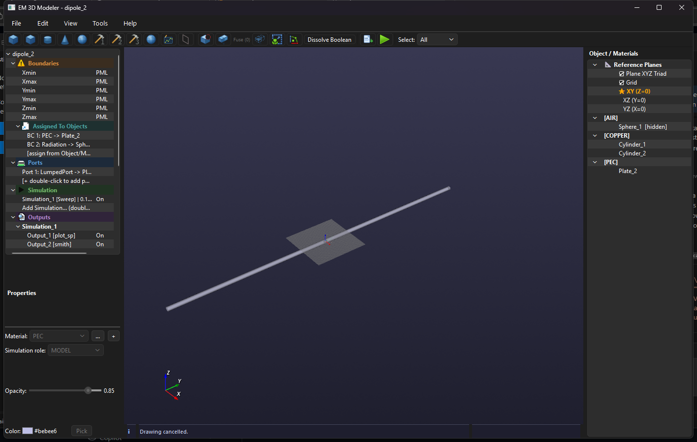

The main window has three working areas:

- **Project Tree, left:** boundaries, ports, simulations, outputs and mesh settings.
- **3D Viewport, center:** geometry creation, selection, camera navigation and visual inspection.
- **Objects / Materials, right:** objects grouped by material, reference planes, visibility and context actions.
- **Info bar, bottom:** status messages, warnings and operation results.

The toolbar provides shortcuts for primitives, sketches, booleans, STEP import, reference planes, grid, units and selection modes.

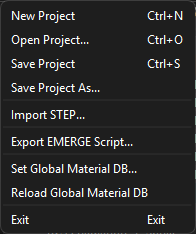

The File menu contains New/Open/Save Project, STEP import, EMERGE script export, global material database actions and Exit.

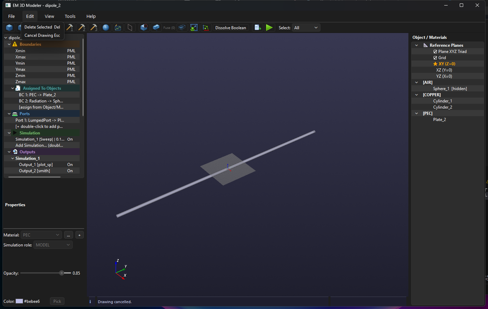

The Edit menu provides Delete Selected and Cancel Drawing.

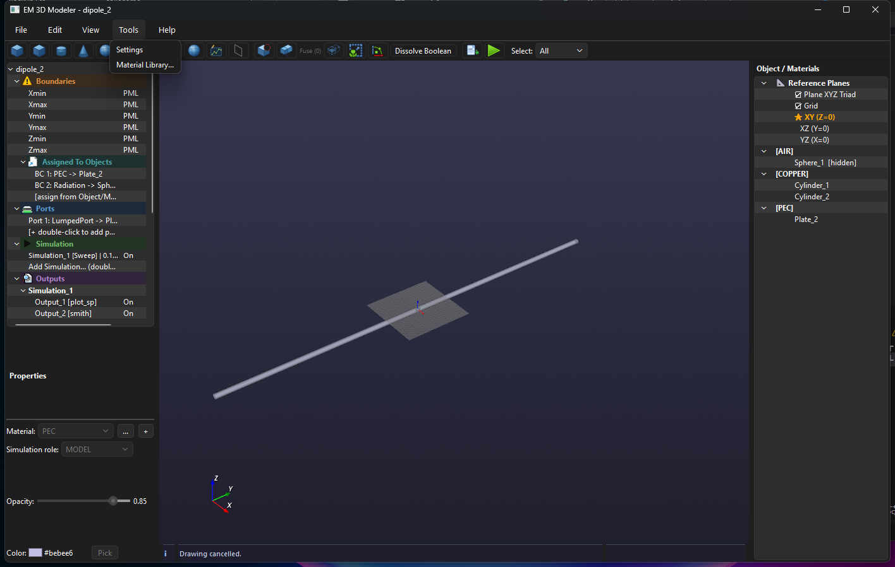

The Tools menu opens Settings and Material Library.

## 2. Project Tree

The tree is the control center for EMERGE preparation.

- **Boundaries:** global X/Y/Z boundary conditions.
- **Assigned To Objects:** object-level PEC, PMC, Open, PML or Radiation assignments.
- **Ports:** configured WaveguidePort, LumpedPort or PlaneWave entries.
- **Simulation:** one or more Sweep, Eigenmode or Parametric jobs.
- **Outputs:** plots grouped under their simulation.
- **Mesh:** default resolution and per-object overrides.

Double-click an editable row to change it. Double-click an add row to create a simulation, port or output. The tree preserves expanded simulation groups when an output is edited.

## 3. Creating and Editing Geometry

### Primitives

Use the toolbar to create Box, Cylinder, Cone or Sphere. The active reference plane and grid determine the drawing plane and snapping behavior.

### Parametric Sketch

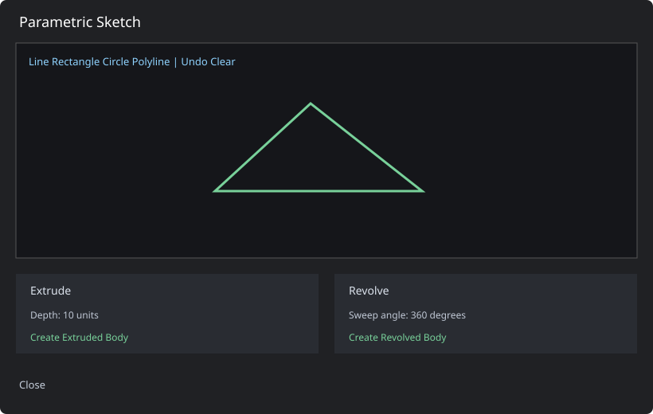

The sketch window contains:

- **Line, Rectangle, Circle, Polyline:** drawing tools.
- **Undo/Clear:** edit the sketch profile.
- **Extrude:** creates a solid from the profile and a depth.
- **Revolve:** rotates the profile around a local axis.

Close the sketch without creating a body to discard the current profile.

### Object properties

Select one object to edit dimensions, material, color and opacity. Opacity is a value from `0.05` to `1.00`; it affects the modeler viewport and is also transferred to the EMERGE 3D viewer.

## 4. Selection, Visibility and Materials

Click an object in the viewport or the Objects / Materials tree to select it. Use Ctrl/Shift for multi-selection in the right-hand tree.

The context menu supports:

- Hide Selected / Show Selected.
- Rename.
- Assign Material.
- Assign Port.
- Assign Boundary Condition.
- Assign Mesh Resolution.
- Set or clear the model role used for simulation export.

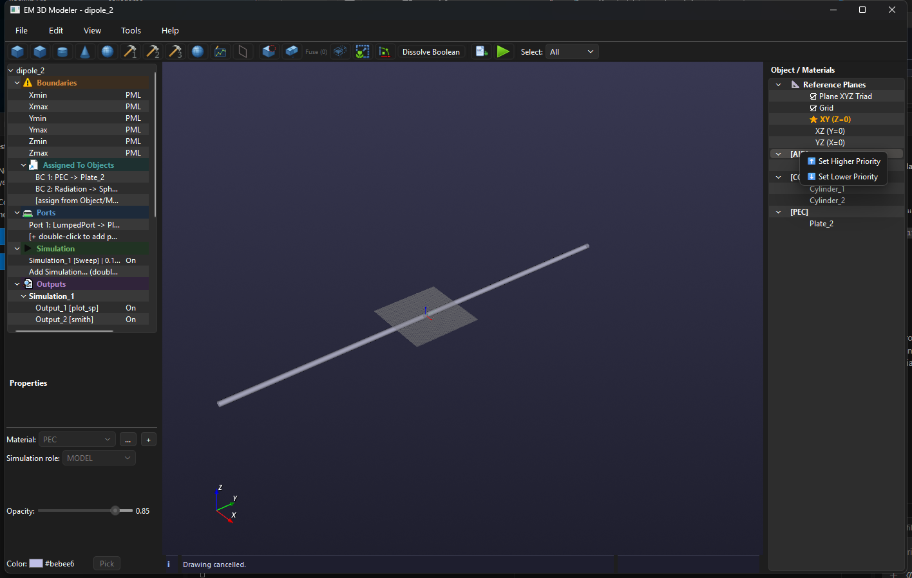

On a material group, the context menu changes material priority with Set Higher Priority and Set Lower Priority.

Hidden objects remain part of the EMERGE simulation. In the EMERGE 3D viewer they are rendered with opacity `0.0`; visible objects keep their modeler opacity.

### Assign Material

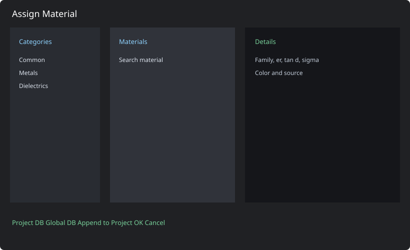

The assignment window is divided into categories, material list and details:

1. Select a category such as Metals or Dielectrics.
2. Choose Project DB or Global DB.
3. Search and select a material.
4. Review electromagnetic properties.
5. Confirm the assignment or append a global material to the project database.

### Material Library

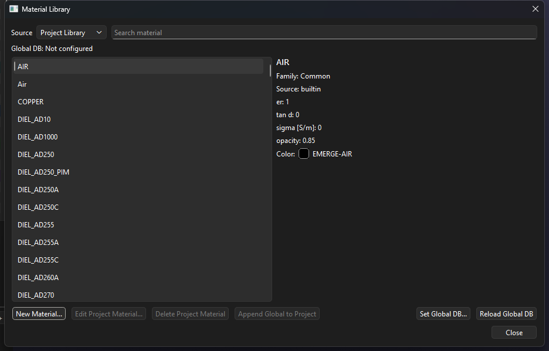

The library manages Project Library and Global Library records. It supports search, property inspection, creation, editing, deletion, global-to-project append, global database selection and reload.

### Material Editor

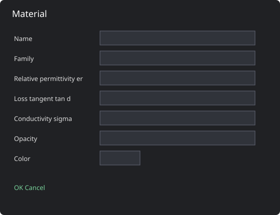

Material records contain a name, family, relative permittivity `er`, loss tangent, conductivity, opacity and display color. Use physically meaningful values before exporting a simulation.

## 5. Boolean Operations

Select the base and tool objects, then choose the operation:

- **Cut:** subtracts tool geometry from the base.
- **Fuse:** combines solids.
- **Common:** keeps the intersection.

For complex STEP meshes, use smaller selections first. The exporter applies repair and fallback strategies for faceted or non-manifold input, but invalid geometry can still prevent a boolean operation.

## 6. STEP Import

Use **File -> Import STEP** or the toolbar button. Both `.step` and `.stp` are supported. Imported solids become editable scene objects and are exported as separate STEP files when an EMERGE bundle is generated.

After import, check:

- object names;
- material assignment;
- visibility and opacity;
- mesh resolution;
- object-level boundary conditions.

## 7. Reference Plane

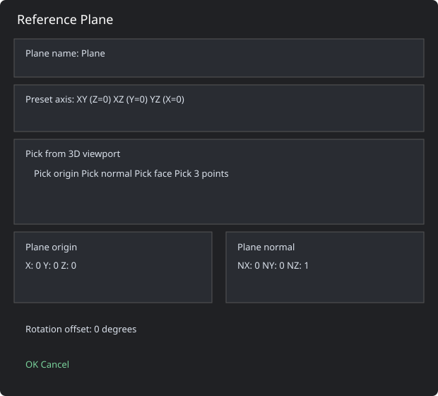
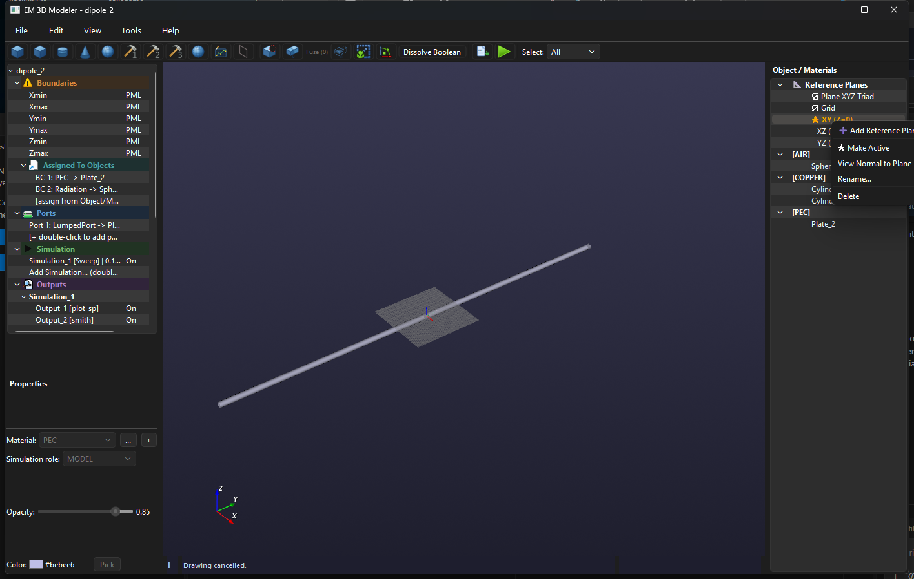

The non-modal Reference Plane window lets you continue working in the viewport while defining a plane.

- **Plane name:** label shown in the Materials tree.
- **Preset axis:** XY, XZ or YZ.
- **Pick origin:** vertex or arbitrary point.
- **Pick normal:** face normal.
- **Pick face:** sets origin and normal together.
- **Pick 3 points:** fits a plane through three viewport points.
- **Origin and normal fields:** exact numeric definition.
- **Rotation offset:** in-plane orientation.

The active plane controls the drawing grid and the orientation of new sketches.

## 8. Settings

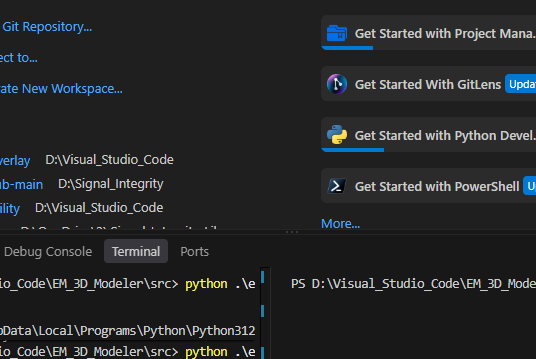
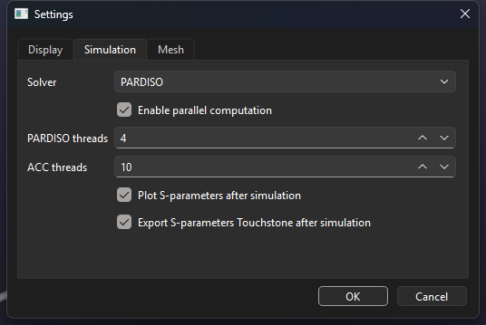
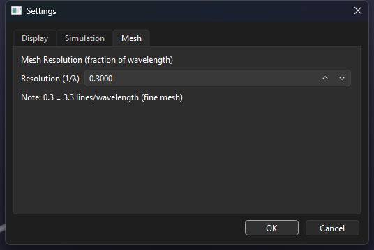

### Display tab

Controls units, decimal separator, workspace size, grid size, plane triad size and selection color.

### Simulation tab

Controls the EMERGE solver, parallel computation, PARDISO/ACC thread counts, automatic S-parameter plotting and Touchstone export.

### Mesh tab

Sets the default mesh resolution as a fraction of wavelength. A value of `0.3` is a practical fine-mesh default. Per-object overrides are available from the project tree.

## 9. Simulation Configuration

### Simulation jobs

Each job has a name, type and enabled state.

- **Sweep:** frequency range with minimum, maximum and step.
- **Eigenmode:** number of modes.
- **Parametric:** parameter name and comma-separated values.

The log verbosity can be set to Trace, Debug, Info, Warning or Error.

### Ports

Port definitions provide the excitation geometry and electrical parameters. A LumpedPort includes width, height, direction, impedance and power. Port plates are excitation surfaces and are not treated as ordinary object boundaries.

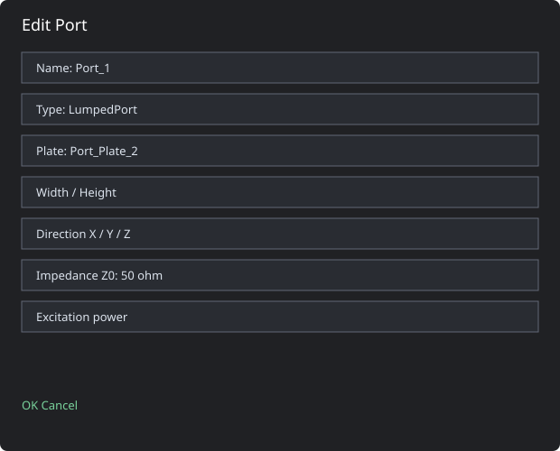

The port editor is used to define the excitation plate, dimensions, direction, impedance and power. Keep the port plate separate from ordinary object boundary assignments.

### Boundaries

Global boundaries apply to Xmin, Xmax, Ymin, Ymax, Zmin and Zmax. Object boundaries are assigned separately and are applied to the boundary faces of the imported STEP objects.

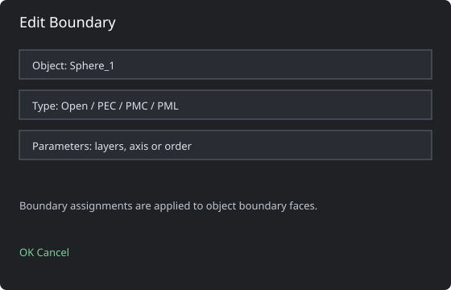

For an object boundary, choose the object, boundary type and any type-specific parameters. Regenerate the EMERGE script after changing an assignment.

### Simulation editor

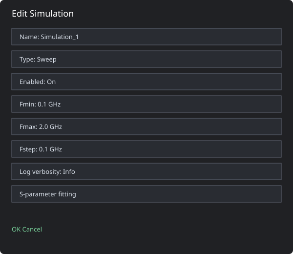

The simulation editor defines the job name, job type, enabled state, sweep range, log verbosity and optional S-parameter fitting. The midpoint of the sweep is also used as the default far-field output frequency.

## 10. Output Plot Window

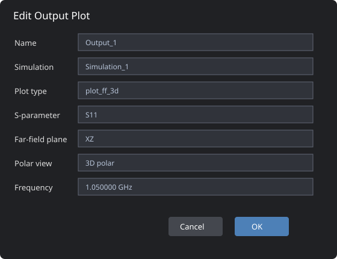

The output dialog shows only the controls relevant to the selected plot type.

- **plot_sp:** selected S-parameter.
- **plot_vswr:** selected S-parameter converted to VSWR.
- **plot:** selected S-parameter magnitude in dB.
- **smith:** selected S-parameter plus port indices.
- **plot_ff:** far-field cut on XY, XZ or YZ and selected frequency.
- **plot_ff_polar:** EMERGE polar plot for the selected plane and frequency.
- **plot_ff_3d:** EMERGE interactive 3D far-field display.

The far-field frequency is entered in GHz. By default it is the midpoint of the configured sweep:

$$
f_0 = \frac{f_{min} + f_{max}}{2}
$$

After reloading the result, EMERGE uses the available frequency sample nearest to `f0`. This is important when the requested value falls between sweep samples.

The 3D plot uses EMERGE's official sequence:

```python
ff3d = field.farfield_3d(boundary_selection)
model.display.add_farfield3d(ff3d, component="normE", quantity="abs", dB=True)
model.display.show()
```

The application does not implement a separate 3D renderer. The viewer, color scale and field surface are provided by EMERGE.

## 11. Context Actions

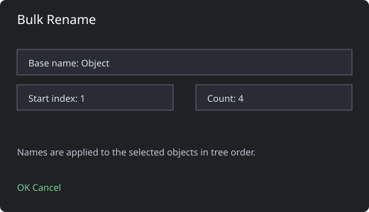

Bulk Rename applies a base name and sequential indices to the selected objects. The order follows the selection order shown by the Objects / Materials tree.

## 12. Running a Simulation

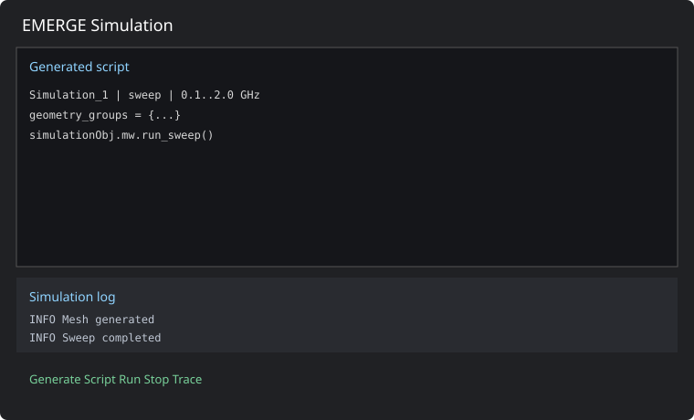

1. Configure geometry, materials, ports, boundaries and mesh.
2. Add or enable a simulation job.
3. Add output plots under that simulation.
4. Open **EMERGE Simulation**.
5. Generate the script and inspect it in the script tab.
6. Run the job and monitor the log.
7. Use the output tree to reload results and display plots.

The generated bundle contains a master script and one child script per enabled simulation. Results are loaded from the corresponding `.EMResults` directory.

## 13. Saving, Loading and Export

- **Save Project:** writes the current project to `.em3d`.
- **Save Project As:** selects a new project path.
- **Open Project:** restores geometry, materials, planes, visibility, opacity, simulations and outputs.
- **Export EMERGE Script:** writes the generated script without launching it.

Project files preserve object visibility and opacity. These values are also used when the EMERGE 3D result viewer is populated.

## 14. View and Navigation

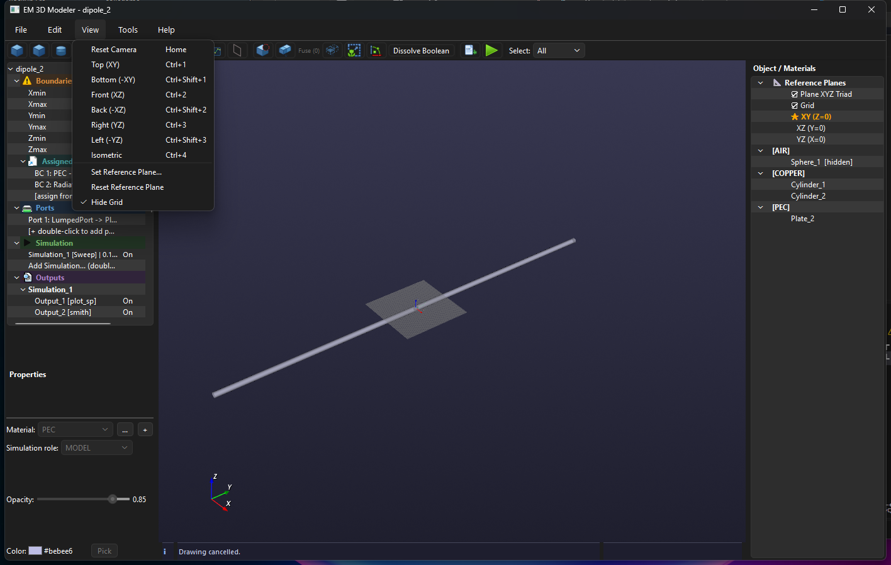

- **Reset Camera:** restore the default camera.
- **Top (XY), Front (XZ), Right (YZ):** orthographic views.
- **Isometric:** 3D overview.
- **Grid:** show or hide the reference grid.
- **Plane triad:** show or hide the XYZ indicator.

Use the viewport selection mode for geometry picking and the Materials tree for reliable multi-selection.

## 15. Portable Windows Build

The portable build is generated with PyInstaller in `onedir` mode. Distribute the complete output directory, not only the executable, because the directory contains the Python runtime, Qt plugins, VTK libraries and application resources.

The portable folder includes:

- `EM3D_Modeler_1.1.9_Beta.exe`;
- `_internal` runtime files;
- `docs` and `Icons` resources where applicable.

Do not delete individual files from the portable directory.

## 16. Troubleshooting

### Far-field result is missing

The simulation must save E/H fields. Enable a far-field output before running the simulation, then rerun it. Older result folders may contain S-parameters but no field data.

### Far-field 3D is empty or hidden

Check the selected frequency, confirm that the result contains saved fields, and verify the integration geometry. Hidden modeler objects remain in the simulation but are intentionally transparent in the EMERGE viewer.

### Boundary error on STEPItems

Object boundaries must be applied to the boundary faces of the objects contained in a STEP group. Regenerate the EMERGE script after changing boundary assignments.

### Qt event-loop or thread warnings on exit

EMERGE/PyVista and Qt may emit shutdown warnings when their rendering threads close. If the application exits normally and no Python process remains, these warnings are non-fatal.

### Boolean operation failed

Check for empty or non-manifold geometry. Try fewer objects and inspect the result after each operation.

### STEP import failed

Check the CAD file in the source application, re-export it as STEP, and retry with a simpler solid if necessary.

### Material is not visible

Reload the Global DB, check the active library source and look for duplicate material names.

## 17. Keyboard Shortcuts

- `Ctrl+N`: New Project
- `Ctrl+O`: Open Project
- `Ctrl+S`: Save Project
- `Delete`: Delete selected objects
- `Esc`: Cancel the active drawing operation
- `Home`: Reset camera
- `Alt+F4`: close the application on Windows

## 18. About

Use **Help -> About** to see the program name, version, release date and current date.
